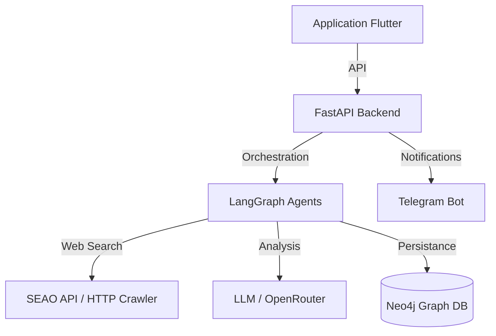

# Architecture du Système

ManelCore ARIA repose sur une architecture modulaire séparant la logique métier, l'orchestration IA et l'interface utilisateur.

## Stack Technique

### Frontend
- **Framework** : Flutter Desktop & Web.
- **Gestion d'état** : Architecture orientée fonctionnalités (features).

### Backend
- **Framework Web** : FastAPI (Python 3.14).
- **Orchestration IA** : LangGraph (pour les workflows cycliques).
- **Service Crawler** : `httpx` pour extraire les pages publiques et le JSON-LD sans navigateur.
- **Notifications** : `python-telegram-bot`.

### Stockage
- **Neo4j** : Base de données de graphes utilisée pour stocker les relations entre entreprises, opportunités, contacts et secteurs.
- **Schéma** : Utilisation de labels `Entreprise`, `Secteur`, `Opportunite`, `Contact`, `Candidature`, `Message`.

## Flux de données

1.  **Input** : L'utilisateur configure ses secteurs cibles via le frontend Flutter.
2.  **Traitement** : L'agent Explorer (LangGraph) s'active, interroge SEAO via API, crawle les pages publiques, et analyse les données.
3.  **Persistance** : Les résultats sont classés par le LLM et sauvegardés dans Neo4j.
4.  **Notification** : Le `TelegramService` alerte l'utilisateur des nouvelles trouvailles.
5.  **Action** : L'utilisateur valide les opportunités via Telegram ou Flutter, déclenchant potentiellement l'agent Contact pour la rédaction d'emails.

## Diagramme Conceptuel

